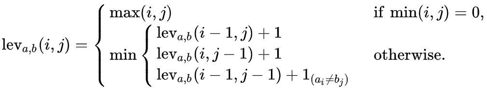

```{r setup, include=FALSE}
knitr::opts_chunk$set(echo = TRUE)
```

The Levenshtein distance is the degree of difference between two strings where a higher value indicates more difference between the strings. In other words, it is the minimum edits needed to transform one string to another string.


### Uses 

The Levenshtein distance is commonly used as a linguistic metric to quantify distance. For example, how different two languages are from one another. 
It can also be used for spell checker and auto correct algorithms by determining the smallest number of edits for a misspelled word to be valid as a suggested replacement. 


### Range 

#### Lower bound

When strings are identical, Levenshtein Distance is 0

* Levenshtein Distance is at least the absolute value of the size difference of the two strings

#### Upper bound

max(m, n) where m and n are the length of the two strings

* Levenshtein Distance is at most the length of the longer string 
* If the strings are the same size, Hamming Distance (i.e., the number of positions with different corresponding symbols in the two strings) is an upper bound
* The Levenshtein Distance between two strings is not greater than the sum of their Levenshtein Distances from a third string (d(x,z) <= d(x,y) + d(y,z), i.e., triangle inequality)
  + **note** - normalizing the Levenshtein Distance breaks triangle inequality and is therefore no longer a valid metric
  
  

### Defining

The Levenshtein Distance Equation is as follows:

{alt="Levenshtein Distance Equation - if min(i, j) = 0 then max(i, j); otherwise min((lev(i-1, j) + 1), (lev(i, j-1) + 1), (lev(i-1, j-1) + 1 if a != b))"}


where $i$ is the index of string $a$ and $j$ is the index of string $b$. 

This equation derives the final Levenshtein Distance by calculating the value of each cell in a distance matrix of the two strings (example below). The matrix derives the distance between all possible prefixes of the two strings where prefixes are incremental additions of letters (e.g., 'doctor' has 6 possible prefixes: d, do, doc, doct, docto, and doctor). In other words, each incremental character or index of string $a$ is compared to each incremental character or index of string $b$. 

The Levenshtein Distance increases by 1 in three situations:

* Deletion - 'n' is deleted from uni**n**formed to uniformed (i.e., lev~*a*,*b*~(*i* - 1, *j*) + 1)
* Insertion - 'g' is inserted from sittin to sittin**g** (i.e., lev~*a*,*b*~(*i*, *j* - 1) + 1)
* Replacement - 'i' is replaced for 'e' from sitt**e**n to sitt**i**n (i.e., lev~*a*,*b*~(*i* - 1, *j* - 1) + 1~(*ai* != *bj*)~)


### Hand Example

To compare the strings 'Doctor' and 'Dalek', begin the matrix with 'Doctor' across the columns and 'Dalek' down the rows, separated by a single row and column to initialize the distance values. Initialize the row below string $a$ (i.e., Doctor) with a 0 prior to the first character (i.e., D) and increment by 1 in each subsequent column through the end of string $a$. Follow this same pattern to initialize the column after string $b$, Dalek, starting with the original 0 input. Providing the matrix with these initial values allows for the subsequent distances to be easily calculated and inserted.


{alt="Initialized Levenshtein Distance Matrix with D o c t o r in row 1, columns 3-8; 0-6 in row 2, columns 2-8; D a l e k in column 1, rows 3-7; and 0-5 in column 2, rows 2-7"}

To fill in the remaining matrix cells, compare the three adjacent cells above and left of the empty cell in question. For example, to derive the first empty cell in our 'Doctor' 'Dalek' comparison which compares the 'D' from Doctor and the 'D' from Dalek (e.g., the blue cell in the matrix below) assess the initialized cells of 0, 1, and 1 (e.g., the yellow cells in the matrix below). 

{alt="Levenshtein Distance Matrix with the cell comparing D from Doctor and D from Dalek (row 3, column 3) in blue and the three adjoining cells with 0, 1, and 1 in yellow (row 2, column 2; row 2, column 3; and row 3, column 2"}

First, identify the minimum value of the three cell values (i.e., 0 for cell values 0, 1, and 1). If the characters of string $a$ and string $b$ being compared with this cell are the same, the minimum value identified is used in the empty cell. If the characters of string $a$ and string $b$ being compared for this cell are different, the empty cell should be assigned the minimum value identified + 1. In the blue cell, the same character, D, is being compared from Doctor and Dalek. Therefore, the minimum value of the three adjacent cells, 0, is used. 

{alt="Levenshtein Distance Matrix with the cell comparing D from Doctor and D from Dalek (row 3, column 3) in blue with the value 0 and the three adjoining cells with 0, 1, and 1 in yellow (row 2, column 2; row 2, column 3; and row 3, column 2"}

This process is continued across the row, assessing each subsequent character in Doctor to the 'D' in Dalek via the 3 adjacent completed cells. Next in our example, we complete the cell for the 'o' in Doctor and the 'D' in Dalek, denoted in blue in the matrix below. 

{alt="Levenshtein Distance Matrix with the cell comparing o from Doctor and D from Dalek (row 3, column 4) in blue and the three adjoining cells with 1, 2, and 0 in yellow (row 2, column 3; row 2, column 4; and row 3, column 3"}


The three adjacent cells with values are now 1, 2, and 0 meaning our minimum value to begin from is 0. Given that the 'o' of Doctor is a different character from 'D' in Dalek, 1 is added to the identified minimum value of 0 for this cell. 
By building on the 3 adjacent cells with values to the empty cell in question, this new cell value of 1 is comparing the prefix 'Do' of Doctor to the prefix 'D' in Dalek. 

{alt="Levenshtein Distance Matrix with the cell comparing o from Doctor and D from Dalek (row 3, column 4) in blue with value 1 and the three adjoining cells with 1, 2, and 0 in yellow (row 2, column 3; row 2, column 4; and row 3, column 3"}

Continuing with this process for the remaining empty cells gives the matrix below. 

{alt="Completed Levenshtein Distance Matrix. Starting with 0 and filling in by rows, the values in each cell are: 0, 1, 2, 3, 4, 5, 6; 1, 0, 1, 2, 3, 4, 5; 2, 1, 1, 2, 3, 4, 5; 3, 2, 2, 2, 3, 4, 5; 4, 3, 3, 3, 3, 4, 5; 5, 4, 4, 4, 4, 5"}

The value in the bottom right hand corner of the matrix is our final Levenshtein Distance for the comparison of two words. The Levenshtein Distance of Doctor and Dalek is 5. 

{alt="Completed Levenshtein Distance Matrix with the bottom right corder of the matrix in blue, which contains a value of 5."}


### Helpful Links

[Measuring Text Similarity Using the Levenshtein Distance by Ahmed Fawzy Gad](https://blog.paperspace.com/measuring-text-similarity-using-levenshtein-distance/#:~:text=The%20Levenshtein%20distance%20is%20a,Insertion)

[Understanding the Levenshtein Distance Equation for Beginners by Ethan Nam](https://medium.com/@ethannam/understanding-the-levenshtein-distance-equation-for-beginners-c4285a5604f0)

[Coding Hand calculations by Anna Chernysheva](https://medium.com/@anna_che/utilizing-numpy-to-measure-word-similarity-levenshtein-distance-221eb51fc290)

[How to Calculate Levenshtein Distance in Python by Zach Bobbitt](https://www.statology.org/levenshtein-distance-in-python/)

[Program to Calculate the Levenshtein Distance in List in Python by Rajwal Agarwal](https://www.scaler.com/topics/levenshtein-distance-python/)
